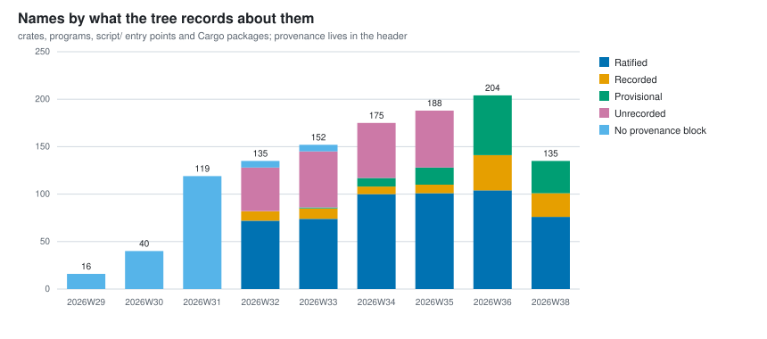

# Project metrics: what moved, week by week

*Name: `notes/project-metrics.md` is ratified (calef, 2026-09-02). He proposed it as
`design/project-metrics.md` and moved it here on the argument that `design/` holds arguments
(`fatal-risks.md`, the decisions, the roadmap) while `notes/` holds what was measured
(`benchmarks.md`, `mutation-testing.md`, `unsafe-obligations.md`). Three of the series below already
have a home in this directory. `script/metrics` and the directory `notes/project-metrics/` are
**provisional**; naming is calef's, and a lane ships a provisional name and says so.*

One row per ISO week, computed by `script/metrics` from git history. The data is
[`notes/project-metrics/weekly.csv`](project-metrics/weekly.csv), in the tree, versioned with the
code it describes, so this page renders the repository's own numbers rather than holding a copy of
them that can rot.

This is the half of `notes/register-of-measures.md` that moves. That register says which numbers
this kernel **owes itself**: which ones a decision rests on, which ones a constant is sized against,
which ones it has defined and cannot yet take. This page says which of them **changed, and when**.
Its opening line is the complaint this page exists to answer:

> This tree measures a great deal and remembers almost none of it.

## Read this before you read a number

**Every row is a restatement, not a report.** The series is regenerated by applying *today's*
definitions to old commits. That is the right choice for a trend, because a series measured seven
different ways is not a series. It is also **not what was reported at the time**, and the gap is
not hypothetical here. On 2026-09-02 alone, three of this project's own instruments turned out to
have been wrong:

- Milestone 214 (a test that prints "skipping" and returns is counted as passed) found 80 sites
  doing exactly that. Twenty-five tests left the pass column on `x86_64` once they told the truth.
- Milestone 212 (`script/falsifications` walks `crates/` only, so the ratio it prints is not the
  tree's) found the falsification denominator excluding the kernel and `user/`.
- DECISIONS §139 (who may read the cycle counter, and by what authority) corrected a figure that
  had conflated a counter's tick resolution with the cost of reading it.

So a bar here is best read as *what the tree would say today about how it looked then*, and the
distance between that and what anybody believed at the time is real.

**And every figure in this project is derived by an agent, including these.** There has been no
external audit of any of it. This is a project measuring itself with instruments it wrote, which is
an argument *for* watching the numbers move rather than against it, but the page should not be read
as an independent account. Where a number here has been checked two different ways, this page says
so explicitly and names the method; everywhere else, it has been recorded twice by the same method,
which is consistency and not validation.

**A missing bar means the record did not exist, not that the number was zero.** The roadmap, the
decision statuses, the falsification records, `design/fatal-risks.md`, the naming provenance blocks
and `design/roadmap/proposals/` each arrived on a date, and before it there is nothing to restate.
The two newest series are the sharpest instances: names have three empty weeks because the
convention that records a ratification was invented on 2026-08-04, and proposals have seven because
the directory was created on 2026-09-04. Neither is backfilled, and each section says so where its
bars are.

**Weeks are ISO weeks in UTC**, which is this tree's date convention. The first commits are stamped
2026-07-12 in the architect's local time and fall on the Monday in UTC, so the series starts at
2026W29 and there is no 2026W28.

**A week is spelled `2026W36`, everywhere.** The chart axis, the CSV's `week` column,
`script/metrics`' own output and the prose on this page all use it, and calef ratified that on
2026-09-02 after the page carried three spellings at once (`2026-W30` in the narrative, `202636` on
an axis, `2026-W29` in the data), which is two more than a reader should have to hold.

It is ISO 8601's designation with the hyphen dropped. It still sorts lexically, and it still cannot
be misread as an ordinary number the way a bare `202636` can. It is also the dictionary key that
makes rerunning `script/metrics` replace a row rather than add one, and the axis label is that key
rather than something derived beside it, so the two cannot drift apart.

## Milestones by status

From `design/roadmap/README.md`'s index table. The two zero weeks are a restatement artifact and
they are the sharpest one on this page. There really was a roadmap in 2026W30: `design/roadmap.md`
landed 2026-07-22 with ten rows in it. It had no status column. A milestone's state was prose inside
a cell, phrased a dozen different ways (`Built`, then `Built (frame scope)`, then `Built:` followed
by a paragraph on which half), which is exactly the defect the status vocabulary was later minted to
fix, and it is unparseable now for the same reason it was unreadable then. The first bar this chart
can draw is the week the column exists.

Rows 1 to 11 were backfilled into the roadmap later by milestone 76 (split the roadmap:
`design/roadmap/README.md` as index, one file per milestone). Eleven milestones had been built before
the first bar; none of them is in it.

**The interesting line is not `BUILT`, it is `NOT-STARTED`.** Reading the rows as they stand at
2026W36: built milestones went 26, 63, 73, 97, 103, 125 across the six weeks the roadmap has
existed, which is a steady rate. Not-started went 16, 35, 32, 43, 62, 79. **The roadmap is growing
faster than the lanes drain it**, and the gap widened most in the last two weeks. That is what a
project generating its own work looks like, and it is the number to watch if the ranking function
ever needs defending: a backlog that grows faster than it is consumed is only healthy while
something is choosing the order.

`REMOVED` appears for the first time in 2026W36, with two rows. The token itself was minted
2026-08-30, when milestone 54 (a network file service a Mac can actually mount) was deleted and the
six words then available could only lie about it.

## Architecture decisions by status

From `design/decisions/README.md`. The grey band in the first three weeks is the honest bucket: a
decision was a `## N.` heading in one 5,320-line `DECISIONS.md` and **nothing said whether it still
held**. Milestone 114 (split `DECISIONS.md`, and give a decision a status) is where a status exists
at all, so counting those early decisions as `DECIDED` would invent a claim the record never carried.
They are counted, and counted as having no status.

139 decisions in eight weeks, of which 17 are `AMENDED` and 3 `SUPERSEDED` at 2026W36. Twenty
decisions revised or replaced out of 139 is the number that says the vocabulary is doing work: a tree
where nothing was ever amended would mean either that every first answer was right or that nobody
went back.

`PROPOSED` is the queue waiting on calef and it stays small (10, 4, 8, 2, 3). It is a queue depth
rather than a backlog, which is the shape it should have.

## Names by what the tree records about them

From the provenance block in each named thing's own header, which is where milestone 115 (the names that
were ratified, and the ones that were refused) put it: a crate's `src/lib.rs`, a program's, a `script/` entry
point's comment, a Cargo package's manifest. `script/names` derives the same four counts by walking
the working tree; this derives them from git history. They share the parse
(`scripts/name_provenance.py`) and not the file walk, so the two agree by construction rather than by
luck, and at 2026W36 they do: 204 names, 104 `ratified`, 37 `recorded`, 63 `provisional`, 0
`unrecorded`.

The four words are what a block *says*. **`Ratified`** is calef ruling, with a date and what was
refused. **`Recorded`** is the tree arguing the name somewhere and nobody ever putting it to him.
**`Provisional`** is whoever coined it saying out loud that they expect it to change. **`Unrecorded`**
is nothing outside the block saying why the name is what it is.

**The total is every named thing, and the four statuses do not have to add up to it.** The pale band
is the difference: named things carrying no block at all. That is a different claim from
`Unrecorded`, which is a block saying the history is silent, and the two are kept apart for the same
reason the decisions chart above will not read a statusless decision as `DECIDED`.

**The first three weeks are the sharpest restatement artifact on this page, and there the band is the
whole bar.** There were 16 named things at 2026W29 and 119 at 2026W31, not one of them carrying
provenance, because the convention that records it did not exist until 2026-08-04. So read those
bars as "nobody was writing this down yet", and read the first blue bar as a convention arriving
rather than as 72 names being ratified in a week. Backfilling them was considered and refused: a
ratification invented to fill a cell would put a false claim in the one record whose entire job is
saying who claimed what.

**The band that survives into 2026W32 and 2026W33 is not an artifact, and it is the most useful thing
this series found.** It is seven names, and all seven are Cargo packages: `kernel`, `user`, `xtask`,
`redoxfs_server`, `redoxfs_host`, `std_exerciser` and the fuzz package. Milestone 115 covered three
surfaces and a package was not one of them, so for two weeks `script/names std_exerciser` answered
"neither a name in the tree nor a recorded refusal" while looking exactly as authoritative as a true
answer. calef found it on 2026-08-18, the `package` kind closed it, and the band goes to zero in
2026W34. **Nothing told this series about that hole**; it walks four kinds today and finds the fourth
missing from the weeks before it existed. A registry with a hole answering confidently is the failure
`script/names`' own header records, and this is what it looks like from outside.

**2026W36 is one milestone doing one thing.** `Unrecorded` goes from 60 to zero, `Recorded` from 9 to
37 and `Provisional` from 18 to 63. That is milestone 264 (sixty names the history cannot justify,
and the research that would let calef rule on them), which converted every name nobody had written a
reason for into one that says something: the reasoning where the history supplies it, an argued
proposal where it does not. The bar is the same height it would have been without it. What changed is
what the tree can say about the names in it.

### A rising `Provisional` band is not debt

This is the number here most likely to be misread, and the misreading would cost something real, so
it is worth saying flatly.

**Nothing in this tree fails because a name is unratified.** `AGENTS.md`:

> `script/names --unratified` is a worklist rather than a wall precisely so that an unratified name
> never blocks anyone's build.

`script/names --check` gates on a block being *present*, never on it saying `ratified`, and that is
deliberate: a gate that demanded the queue be drained would block every unrelated merge behind a
review nobody can hurry.

**A provisional name is the mechanism working, not the mechanism failing.** It is what `AGENTS.md`
tells a lane to ship when it needs a name and the decision is calef's, and it exists to convert an
expensive decision into a cheap one by refusing to pretend it is settled. A lane that coins a name,
argues it, records what it refused and marks the result provisional has done the thing the convention
asks for. A lane that quietly ships a name without saying it is unsigned has not, and it will not
show up on this chart at all, which is the limit of what a count of signatures can see.

So the green band going up means lanes are naming things and being honest that nobody ruled. It is a
queue depth against one person's attention, and this project's scarcest resource is exactly that
attention, so a growing queue says the tree is growing faster than one reviewer rules on it and says
nothing at all about the names being wrong. **The band worth an alarm is `Unrecorded`**, because that
is a name nobody anywhere argued for, and it is the one this chart has at zero.

## Unnumbered proposals

**74 at 2026W36, and zero in every week before it**, which is the `proposals_unnumbered` column in
the CSV. There is no chart, because there is one bar: `design/roadmap/proposals/` was created on
2026-09-04 by milestone 247 (follow-on work named by a finished
milestone goes nowhere, and this is the third time), and a single measurement is a number rather
than a series. The column exists so that the series accumulates from here.

**Nothing else on this page could count these, and that is the reason for the column.** The
milestones chart reads index rows out of `design/roadmap/README.md` and keys on a milestone number.
A proposal is *defined* by not having one: a lane that finds work it is not doing writes
`design/roadmap/proposals/<slug>.md`, because the thing concurrent lanes collide over is the number
and not the authority, and an integrator assigns the number at promotion. So the pile was invisible
to every column here by construction, not by oversight.

### What a rising line means here, which is not what it means for names

The naming section above says a rising `Provisional` band is not debt. **Do not carry that reading
across.** A provisional name costs nothing while it sits, because nothing is waiting on it. An
identified piece of work that nobody has scheduled is a different object: something in this tree was
found to be wrong or missing, and the finding is parked. That is closer to debt, and it would be
dishonest to file it under the same reassurance.

But the count alone cannot tell you whether the pile is stalling, for two reasons that are worth
stating rather than leaving to a reader's optimism.

**It is a net count, and the flow is gross.** Five proposals have left the directory since it
existed, so 86 have been written and 81 remain. They left in two different ways, which is the more
interesting half: one was promoted to a number the ordinary way (milestone 256, x86_64 places PCI BARs in a
hardcoded window, and on xenon that window is RAM), and the others were **done**, by a lane that picked the file up and fixed the
thing, sometimes filing a narrower proposal in its place (`the-tcb-capability-that-outlives-start`
became a fix plus `the-region-half-of-the-retention-declaration`). A flat line on this column would
be consistent with a stalled pile and equally consistent with one draining exactly as fast as it
fills, and nothing here distinguishes them.

**Age is the tell, and age is not in this column.** `script/roadmap`'s own header says so: a gate on
age ("no proposal older than N days") would be routed around by not writing proposals, which is
worse, so what it does instead is print the count and the date of the oldest on every `script/lint`
run. Today the oldest is 2026-09-03 and the directory is a week old, so nothing has had time to go
stale and the count says nothing yet. **The number to watch is not this one going up; it is this one
going up while the oldest date stops moving.** `script/roadmap --proposed` lists them oldest first
and is the view that answers it.

**And a rising line is still better than the alternative it replaced.** The work in this pile used
to live in lane reports, which are read once, by one person, on the day they are written.
`AGENTS.md` records what that cost: milestone 90 exists only because calef happened to be at his
desk the day a report named it, and milestone 94 swept the tree for exactly this category and then
left its own inventory in a pull request body for twelve days. 74 visible proposals is a worse
number than 74 scheduled milestones and a far better one than 74 findings nobody can enumerate.

## Rust in the tree

Every tracked `.rs` file outside `vendor/`, with `kernel/src` split from the rest. The split is the
point rather than a courtesy: the kernel is commented far more heavily than production code would be,
deliberately, so a single tree-wide ratio hides the thing that makes the number interesting.

A line counts as code if anything survives blanking its comments and string literals, and as a
comment otherwise. A line with code and a trailing comment is code.

**Two things worth reading.**

**The kernel's comment share is not flat, it is climbing.** `kernel/src` was 39.3% comment lines at
2026W31 and is 45.3% at 2026W36, rising every week in between. `AGENTS.md` says 40%, which was
accurate when it was written and is now three weeks stale. The rest of the tree is doing the same
thing more slowly, 31.5% to 41.4%. Whether that is the kernel getting better documented or the
comment-to-code ratio drifting past what a reader wants is not a question this instrument can
answer; it can only say the number moved. Flagged rather than corrected in `AGENTS.md`, because that
is calef's file.

**Total Rust fell for the first time between 2026W35 and 2026W36**, from 192.0k lines to 189.0k,
while the week was still adding code. That is milestone 54's deletion, which is also the `REMOVED`
bar two charts up. A line count that only ever rises is measuring typing; one that falls when code is
deleted is measuring the tree.

## BUGS sections

**Rising is good here, and it is worth saying plainly because the word says the opposite.** A `BUGS`
section is the FreeBSD convention this tree copies hardest: an honest limitation written next to the
feature it limits, in the manual, rather than hidden in a tracker. `AGENTS.md` calls them "not
modesty, they are the mechanism", and the reason is a newcomer's: someone who hits a limitation the
docs named will trust the docs, and someone who hits one the docs hid will not trust anything again.

Zero in the first two weeks, 359 at 2026W36 (238 markdown headings and 121 in Rust doc comments).
A falling line here would be the alarming one.

## Kani proof harnesses, and what can falsify them

The harness count is the whole series; the split into "falsification on record" and "unfalsified"
has exactly one point, because the record itself is four days old. Milestone 194 (build §134: the
falsification record, its lint, and the sweep that replays it) built it, and DECISIONS §134 (a
harness carries a machine-replayable falsification record, or it is not evidence) is the reason.

**36 of 146.** This is fatal risk 2's number, and the risk is that the proofs prove trivia. A proof
nobody can turn red is one level of indirection away from evidence, which is the same shape as a
roadmap status that was wrong in both records. A harness with no record at all is counted as
unfalsified, because that is what it is.

The harness count itself is taken after blanking comments, which matters more than it sounds: a raw
grep for `#[kani::proof]` finds 151, because `kernel/src/syscall.rs` explains in prose what one is
and `vendor/` and a lint shim carry four more.

## unsafe blocks outside kernel/src/arch/

Blocks per 10,000 code lines, outside `kernel/src/arch/`, which is `script/lint`'s census and the
one number in this tree that is actually gated on a direction. The dashed line is the ceiling.

227, 243, 138, 121, 111, 93, 77, 77. **The absolute count of unsafe blocks outside `arch/` went from
171 to 704 over the same period while the density fell by two thirds.** Both are true and only the
second one is about soundness: the first is a system being built. That is why the gate holds a
ratio.

The one rise is 2026W29 to 2026W30, and it is the honest shape of an early kernel: the tree was
7,500 lines and one driver moved the number.

### How much this particular series has actually been checked

This is the one place on the page where a number has been checked two different ways, so it is worth
separating what that bought.

**A consistency check, which is what comparing against `notes/unsafe-obligations.md` is.** That note
carries a seven-point table, 227.8 down to 78.8, taken on seven different dates. It is *not* an
independent record: it is the output of this same derivation, written down seven times by lanes.
Reproducing it proves the walk agrees with what was recorded, and nothing more. It did agree. On
2026-08-18 the reconstruction hits **747 blocks over 80,359 lines exactly**, at commit `93607fa4`,
which is both figures to the digit. `unsafe impl Send`/`Sync` and the inside-`arch/` count match the
recorded value at five of the seven dates, and are within three at the other two. The residual is
which commit inside the day the column was taken at, not a difference in definition. The 2026-08-23
column is the worked example: the table prints 777 and this reconstruction prints 799, and the note's
own prose already says the count immediately before that lane's reduction "was 799, not 777", over
85,476 lines, which is this reconstruction to the digit.

**An independent check, which is a different thing.** A second counter was written from scratch for
this: a character scanner that tracks Rust's real lexical states rather than blanking comments and
literals with one regular expression. It differs deliberately in two places the regex is loose:
block comments **nest** in Rust and the regex's do not, and a lifetime `'a` is not the start of a
character literal. Run over every in-scope file at `705e3919`, the two methods agree on **701 blocks outside `arch/`
and 253 inside, with zero files disagreeing** (that commit's own row; the number moved with the tree
afterwards). That is the check worth having, and it says the shortcuts in `script/lint`'s regex do
not bite in this tree.

## The nine things that would kill nife

From `design/fatal-risks.md`, which is four days old, so this is one bar and will become a series.
Four of the nine have had an experiment run; five have not.

**Tested does not mean green.** A verdict column was considered and left out on purpose: three of the
four statuses written so far say GREEN or AMBER in capitals and risk 7's says neither, so a colour
series would be a script reading a sentence and guessing. The count of risks that have been put to an
experiment at all is the fact that file actually carries. The verdicts are in the file, in prose,
where a person can read them.

## Coverage

**Empty, and it will stay empty for every week before this page existed.** Coverage is the one metric
here that cannot be recovered by walking history: it is computed per pull request in CI, stored
nowhere, and reconstructing it means a full instrumented build at every checkout in the history.
`script/metrics` is not allowed to build anything, which is what makes eight weeks of backfill cost
six seconds rather than a machine.

So the series starts when the weekly workflow first runs, and the empty bars are left visible rather
than the chart being dropped. A metric quietly omitted is worse than one visibly missing, which is
the same argument `script/falsifications` makes for its `unfalsified` state one directory over.

The floor `script/coverage` gates on is per file, not this aggregate; the dashed line is that floor
drawn for scale.

## How it stays current

`script/metrics --update` recomputes the current week's row and redraws the charts.
`.github/workflows/metrics.yml` runs it every Monday and opens a pull request if anything changed,
following `toolchain-bump.yml`, which is the closest existing shape.

**It is idempotent, and that is a property of how the file is written rather than a check on top of
it.** The CSV is never appended to. It is read into a dictionary keyed by ISO week, the week being
written **replaces its own entry**, and the whole file is rewritten from that dictionary in sorted
week order with a fixed column order. So running it twice in one week produces the same bytes, and so
does a backfill against a history that has not moved. `script/metrics --check` is exactly "run it
into memory and compare", which is why it can be trusted to say whether the tree is current.

The representative commit for a week is the first-parent commit with the greatest committer date
inside it. First-parent because that is the trunk a reader means by "the tree on that date", and
committer date because a merge's author date can be days old and would file the merge under the week
its branch was cut. For a past week that answer never changes, which is the other half of the
idempotence; for the current week it is `HEAD`, and the row moves as work lands.

## BUGS

- **`script/metrics --check` is deliberately not in `script/lint`.** Any commit changes `HEAD`, and
  the current week's row records the commit it was taken at, so a gate on it would fail every pull
  request that touched anything. The workflow is the mechanism; this is rung two of `AGENTS.md`'s
  ladder declining to be rung one, said out loud rather than left as an omission.
- **Two of the three definitions are now shared, and the third is checked instead** (milestone 236,
  2026-09-03). The `unsafe` census and the comment-and-literal strip the code and comment line split
  is built on live in `scripts/rust_source.py`, which `script/lint` and this script both import, so
  there is one definition and nothing left to drift. The harness count could not be collapsed the
  same way: `script/lint` and `script/falsifications` attribute each harness to a workspace package
  out of `cargo metadata`, and this script reads blobs at revisions nobody has checked out and
  cannot run cargo against them. `script/lint` runs all three derivations and fails on a
  disagreement, which is the weaker answer and is said to be the weaker answer.
- **A line inside a multi-line string literal counts as a comment line.** Wrong in principle,
  negligible in this tree.
- **The charts follow the reader's operating system colour preference, not GitHub's theme toggle.**
  GitHub serves an SVG in a markdown page as an ``, so a media query inside it cannot see the
  host page. A reader whose GitHub theme disagrees with their OS gets the wrong background.
- **`patches/` is outside the `unsafe` census**, inherited from `script/lint` along with its reason.
  That code does run on the machine, so it is a real hole rather than a boundary, and
  `notes/register-of-measures.md` records the blocks it leaves uncounted.
- **`names_total` is not the sum of the naming columns**, which is the one place a column here
  breaks the pattern the milestone and decision columns set. It is every named thing in that week's
  tree; the four statuses count the ones whose header carries a block that parses. The gap is drawn
  as a band and explained in that section, and it is kept rather than folded into `Unrecorded`
  because silence is not a claim.
- **The naming columns count signatures, not names.** A name can be ratified and bad, or provisional
  and perfect. Nothing here reads a name, and `script/names`' own `BUGS` is the longer version: it
  cannot check that a recorded reason is still true, that a date is right, or that a `recorded`
  citation leads anywhere.
- **Four kinds of named thing, and the tree names more than four kinds.** Crates, programs,
  `script/` entry points and Cargo packages carry provenance blocks, so those are what this counts.
  Public function and method names have been calef's call since 2026-08-23 and nothing counts them;
  types, `scripts/` helpers and directory names are outside `script/names`' surfaces too, and
  notes/naming.md's `BUGS` carries what that leaves uncovered.
- **`proposals_unnumbered` is a net count and cannot see the flow.** Five proposals have left the
  directory and 81 remain; a flat line would be consistent with a stalled pile and with one
  draining as fast as it fills. The measurement that would tell them apart is the age of the oldest,
  which `script/roadmap --check` prints on every lint run and this column does not carry.
- **Nothing here is audited by anyone outside this project.** Stated once at the top and again here,
  because a dashboard is exactly the artifact that makes a reader stop asking.

