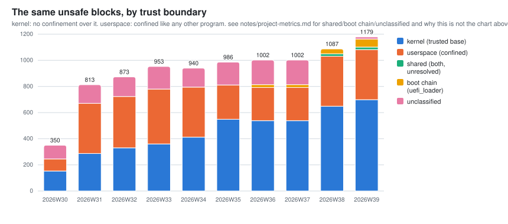
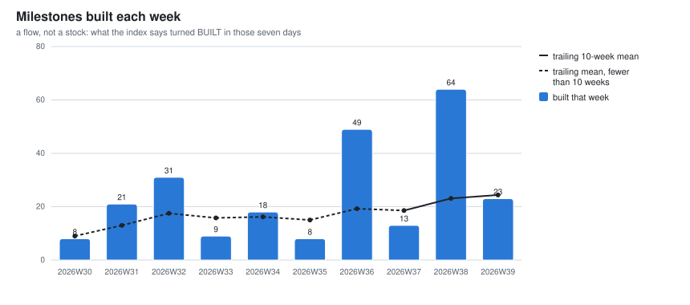
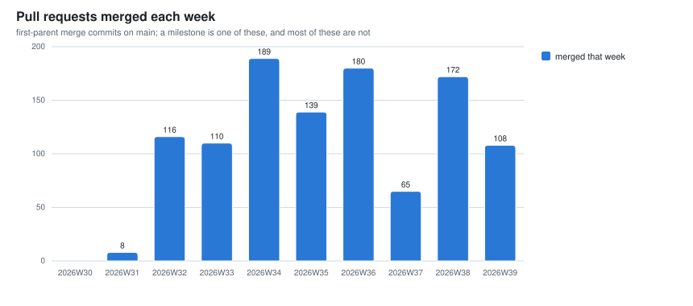
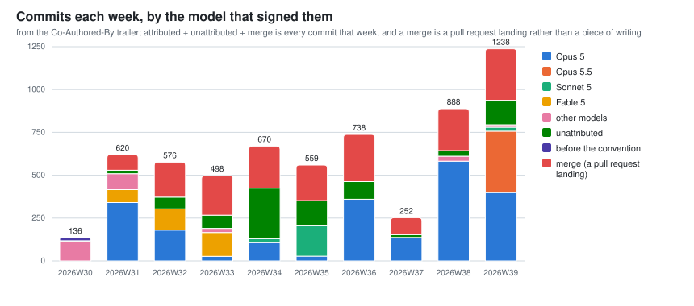
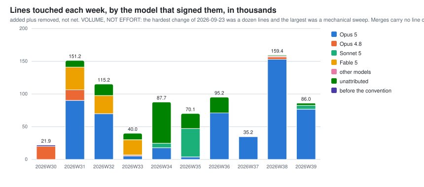
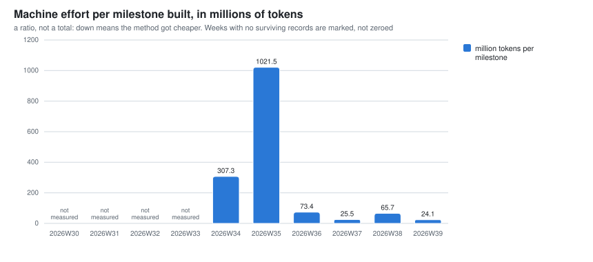
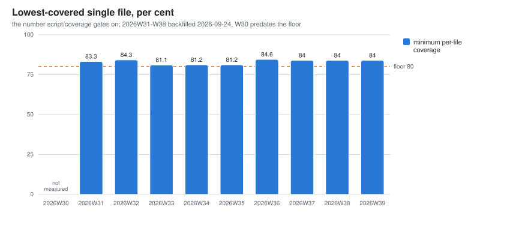
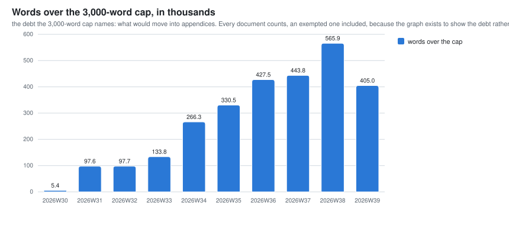
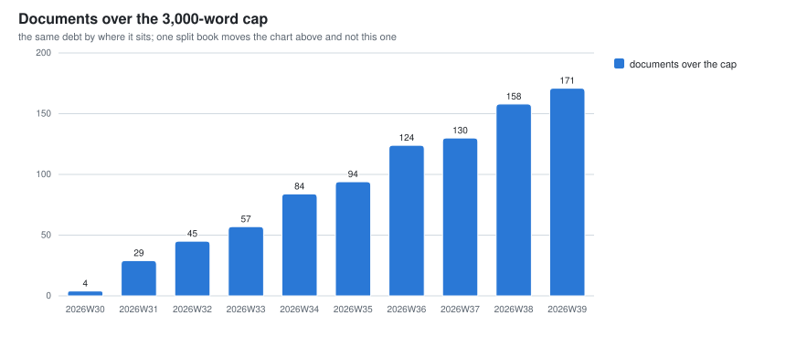

# Project metrics: what moved, week by week

*Name: `notes/project-metrics.md` is ratified (calef, 2026-09-02). He proposed it as
`design/project-metrics.md` and moved it here on the argument that `design/` holds arguments
(`fatal-risks.md`, the decisions, the roadmap) while `notes/` holds what was measured
(`benchmarks.md`, `mutation-testing.md`, `unsafe-obligations.md`). `script/metrics` and the
directory `notes/project-metrics/` are **provisional**; naming is calef's, and a lane ships a
provisional name and says so.*

One row per ISO week, computed by `script/metrics` from git history. The data is one CSV per
measure in [`notes/project-metrics/`](project-metrics/), in the tree, versioned with the code it
describes.

**This page is a deck** (calef, 2026-09-24). A chart is a heading, an image, and at most a line or
two saying what it plots and what would otherwise be misread. Everything longer, the definitions,
the arguments behind a measure, the deadlines, the reconciliations and the dated analyses, lives in
[`notes/register-of-measures.md`](register-of-measures.md) under *The weekly series*, which is the
half of this pair that does not change. Keep it that way: a caveat that cannot survive one line is
not a caption, it is a register entry.

## Read this before you read a number

- **Every row is a restatement, not a report.** The series applies *today's* definitions to old
  commits, which is right for a trend and is not what anybody believed at the time.
- **Every figure here is derived by an agent and none of it is externally audited.** Where a number
  has been checked two different ways, the register says so and names the method.
- **A missing bar means the record did not exist, not that the number was zero.** No empty cell is
  ever drawn as a nought.
- **Weeks are ISO weeks in UTC**, spelled `2026W36` everywhere, and the series starts at 2026W29
  because that is where the first commit falls. There is no 2026W28.
- **The charts show the ten most recent weeks; the CSV keeps every one.** A week is never deleted,
  only no longer drawn.
- **A milestone is not a fixed unit and a pull request is not a unit of value.** Read the shape, not
  the height.

## The nine things that would kill nife

From `design/fatal-risks.md`, by **Experiment status**: `RUN`, `NOT-RUN` or `CANNOT-RUN`, the field
calef ratified on 2026-09-23. It says whether an experiment happened, never what it found; the
verdicts are prose in that file, and the early bars are short because the field did not exist yet.

## Kani proof harnesses, and what can falsify them

The harness count, split into those carrying a machine-replayable falsification record and those
without. A harness with no record at all is counted as unfalsified, because that is what it is.

## unsafe blocks outside kernel/src/arch/

Blocks per 10,000 code lines outside `kernel/src/arch/`, which is `script/lint`'s gated census; the
dashed line is the ceiling. The absolute count rose from 171 to 704 over the same period while the
density fell by two thirds, and only the ratio is about soundness.

## The same unsafe blocks, by trust boundary

The same census split by what confines the code: kernel privilege, userspace confinement, both, and
the pre-kernel boot chain. Before 2026W38 the `unclassified` band is crates whose names have since
changed, so read the kernel and userspace bars in those weeks as undercounts of both sides.

## Milestones built each week

A flow: milestones whose `Built:` date falls in that week, read from today's tree for every week.
**It does not reconcile with the `Built` stock below, and that is the design**; the gap is the lag
between finishing a milestone and flipping its row.

## Pull requests merged each week

The second flow, counted from `main`'s merge subjects rather than the GitHub API so that it
backfills to the first commit. 2026W29 and 2026W30 are genuine zeros: the practice starts in
2026W31.

## Which model wrote it

From the `Co-Authored-By` trailer. Attributed plus unattributed plus merge is every commit that
week, and **a merge is a pull request landing rather than a piece of writing**. 2026W29 predates
the convention, so it is absent rather than zero.

## Lines touched, by the model that signed them

**Added plus removed, not net, and volume rather than effort.** The hardest change of 2026-09-23
was a dozen lines and the largest was a mechanical sweep. Merges carry no line count.

## What this project costs

Millions of lane tokens per milestone built. **2026W29 through 2026W33 are absent, not zero**: those
records were never in git and were already gone when the capture started, and the current week is
always understated because its tokens accumulate all week.

## Architecture decisions by status

From `design/decisions/README.md`. The grey band in the first three weeks is decisions that predate
a status existing at all, counted as having none rather than as `DECIDED`.

## Names by what the tree records about them

What each named thing's own provenance block says. The pale band is named things carrying no block,
which before 2026-08-04 is every one of them. **A rising `Provisional` band is not debt**: nothing
in this tree fails because a name is unratified, and the band worth an alarm is `Unrecorded`.

## Milestones by status

From the milestone blocks in `design/roadmap/`, with unnumbered proposals stacked on top as the
eighth series: work identified and not yet entered into the roadmap, which unlike a provisional name
is closer to debt. The two zero weeks are a restatement artifact, not an empty roadmap; the line to
watch is `NOT-STARTED`, which grows faster than the lanes drain it.

## Rust in the tree

Every tracked `.rs` file outside `vendor/`, with `kernel/src` split from the rest, in thousands of
lines. **Lines are volume, not effort.** A line with code and a trailing comment counts as code.

## BUGS sections

Markdown headings plus Rust doc comments. **Rising is good here**: a `BUGS` section is a limitation
written next to the feature it limits, so a falling line is the alarming one.

## Coverage

Line coverage, each week measured by its own tree's `script/coverage` on its own pinned nightly, so
this is the one series on the page that is not a restatement. 2026W29 is empty because no instrument
existed yet; the dashed line is the per-file floor `script/coverage` gates on, drawn for scale.

## The lowest-covered file

The minimum per-file coverage, which is the number `script/coverage` actually gates on at 80%.
**The aggregate above can hold steady while one file slides**, so this is the panel that predicts a
failing build; the series starts at 2026W39 because earlier runs kept only the aggregate.

## The prose budget

calef ratified a 3,000-word cap per document on 2026-09-23, enforced as a ratchet. The first chart
is the debt, the words that would have to move into appendices for the tree to meet its own rule;
the second is how many documents that work sits in. **A ratchet is invisible without a graph**,
which is why there are two.

## How it stays current

`script/metrics --update` recomputes the current week's row and redraws the charts, and
`.github/workflows/metrics.yml` runs it daily and opens or refreshes a pull request if anything
changed. Coverage is taken on Monday only, because it is the one column that needs a build. The cost
columns cannot be produced by any workflow, because they are read from session records that live on
one laptop and never in git; `script/effort --snapshot` and `script/cadence-check` stand behind
them, and neither invents a number for a week nobody captured. The register has the rest: the
snapshot's `launchd` shape, why the file is idempotent, and which commit represents a week.

## BUGS

- **`script/metrics --check` is deliberately not in `script/lint`.** Any commit changes `HEAD`, and
  the current week's row records the commit it was taken at, so a gate on it would fail every pull
  request that touched anything. The workflow is the mechanism; this is rung two of `AGENTS.md`'s
  ladder declining to be rung one, said out loud rather than left as an omission.
- **A newly added column can go blank across history if a CSV merge conflict is resolved with
  `--update` instead of `--backfill`.** `--update` only touches the current week and any week
  missing outright; a row the CSV already holds is left exactly as it was, new columns included, so
  a merge that resolves two branches' concurrently-added columns into one header needs a `--backfill`
  afterward or the older rows carry the new columns as empty cells. This happened to
  `unsafe_trust_*` from 2026-09-21 to 2026-09-23 (the register's *The weekly series* has the whole
  case) and nowhere else, checked at the time. Empty, not zero, is the tell: `git diff` on
  `notes/project-metrics/` after any commit that merges two metrics branches is worth a look before
  trusting the row count.
- **`milestones_built_this_week` will not equal the week-on-week change in the `Built` stock, in
  any week.** It is deliberate and the register argues it, but it reads as an error to anyone who
  differences two rows and expects the flow to fall out, which is what happened on 2026-09-23.
  Nothing gates the two against each other and nothing can: the gap is the lag between finishing a
  milestone and flipping its row, which is a real property of the record rather than a defect in
  either column.
- **A milestone dated in a week the series has no row for is dropped**, which is milestone 1 (boot
  to Rust on QEMU `virt`, and print to the PL011 UART) and 2026W28. `script/metrics` prints a stderr
  line naming it since 2026-09-23; before that it was silent. A reader summing the chart gets 248
  where the tree holds 249 dated blocks.
- **Two of the three definitions are now shared, and the third is checked instead** (milestone 236,
  2026-09-03). The `unsafe` census and the comment-and-literal strip the code and comment line split
  is built on live in `scripts/rust_source.py`, which `script/lint` and this script both import, so
  there is one definition and nothing left to drift. The harness count could not be collapsed the
  same way: `script/lint` and `script/falsifications` attribute each harness to a workspace package
  out of `cargo metadata`, and this script reads blobs at revisions nobody has checked out and
  cannot run cargo against them. `script/lint` runs all three derivations and fails on a
  disagreement, which is the weaker answer and is said to be the weaker answer.
- **A line inside a multi-line string literal counts as a comment line.** Wrong in principle,
  negligible in this tree.
- **The charts follow the reader's operating system colour preference, not GitHub's theme toggle.**
  GitHub serves an SVG in a markdown page as an ``, so a media query inside it cannot see the
  host page. A reader whose GitHub theme disagrees with their OS gets the wrong background.
- **`patches/` is outside the `unsafe` census**, inherited from `script/lint` along with its reason.
  That code does run on the machine, so it is a real hole rather than a boundary, and
  `notes/register-of-measures.md` records the blocks it leaves uncounted.
- **`names_total` is not the sum of the naming columns**, which is the one place a column here
  breaks the pattern the milestone and decision columns set. It is every named thing in that week's
  tree; the four statuses count the ones whose header carries a block that parses. The gap is drawn
  as a band and explained in the register, and it is kept rather than folded into `Unrecorded`
  because silence is not a claim.
- **The naming columns count signatures, not names.** A name can be ratified and bad, or provisional
  and perfect. Nothing here reads a name, and `script/names`' own `BUGS` is the longer version: it
  cannot check that a recorded reason is still true, that a date is right, or that a `recorded`
  citation leads anywhere.
- **Four kinds of named thing, and the tree names more than four kinds.** Crates, programs,
  `script/` entry points and Cargo packages carry provenance blocks, so those are what this counts.
  Public function and method names have been calef's call since 2026-08-23 and nothing counts them;
  types, `scripts/` helpers and directory names are outside `script/names`' surfaces too, and
  design/naming.md's `BUGS` carries what that leaves uncovered.
- **`proposals_unnumbered` is a net count and cannot see the flow.** Five proposals have left the
  directory and 81 remain; a flat line would be consistent with a stalled pile and with one
  draining as fast as it fills. The measurement that would tell them apart is the age of the oldest,
  which `script/roadmap --check` prints on every lint run and this column does not carry.
- **The cost columns can stop updating and the charts will not say so.** They will simply stop
  gaining weeks, and an absent week is drawn as absent, which is correct and is also exactly what a
  dead capture looks like. `script/cadence-check` is the thing that speaks, and it speaks on
  patagonia through `scripts/trunk-health.sh`, which inherits that watcher's own recorded gap: a
  machine asleep is a watcher not watching.
- **`lane_tokens` counts this project's whole session, not its lanes.** Every response in a record
  stream filed under the nife project directory is counted, including a maintainer answering a
  question, a review, and this page being written. It is the cost of the project, not the cost of
  the code, and the name is narrower than the thing.
- **Machine effort cannot be attributed to a milestone**, so the chart's ratio is a weekly average
  over everything that happened rather than a per-milestone cost. The raw material for the join is on
  disk (every record carries a `gitBranch`, and a lane's branch is named for its milestone) and the
  join is deliberately not built: a branch is not a milestone, and a wrong attribution is worse than
  none.
- **`price_per_mtok_at_date` restates old weeks at the newest rate in the ledger.** The ledger is
  appended to, and nothing reads a rate as of a week; the last row for a model wins. A rate change
  would therefore re-price history, which is the same restatement hazard this page opens with and is
  worse here because a dollar figure reads as a measurement.
- **$200 of the subscription is outside `cash_spend` and stays outside it.** It was paid in 2026W28
  and the series has no row for that week, because no commit fell in it. `script/metrics` prints the
  amount on every run; nothing folds it into a neighbour, because that would put money in a week it
  was not spent in to make a column sum tidily.
- **`merged_pull_requests` can only see GitHub's default merge subject.** A merge made any other way
  is not counted and cannot be distinguished from an ordinary merge commit afterwards. The total
  matches what a maintainer counted by hand on 2026-09-21, which is evidence and not proof.
- **A band that goes to zero across the whole chart window changes the colours of the bands after
  it.** `series_of` drops an all-zero series and the palette is indexed over what survives, so when
  2026W30 leaves the ten-week window the `before the convention` band disappears and every band
  below it in the by-model legend shifts one hue. The legend is redrawn with it, so nothing is
  mislabelled; a reader comparing two screenshots taken a week apart will still see a colour move.
  It is pre-existing behaviour of every chart here and it is recorded because the by-model panel is
  the first one certain to hit it.
- **Nothing here is audited by anyone outside this project.** Stated once at the top and again here,
  because a dashboard is exactly the artifact that makes a reader stop asking.
