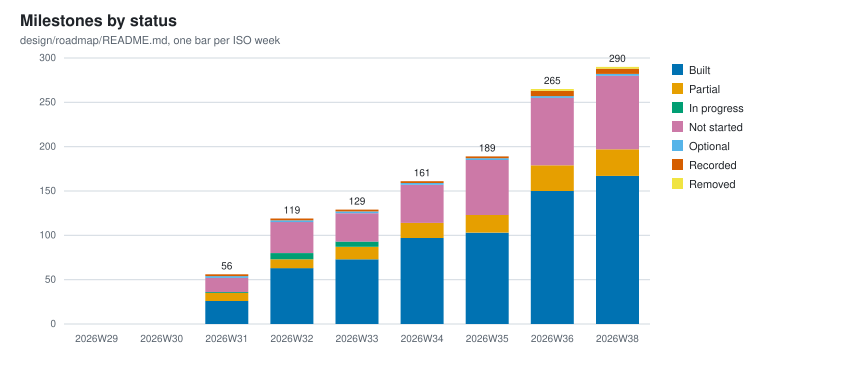
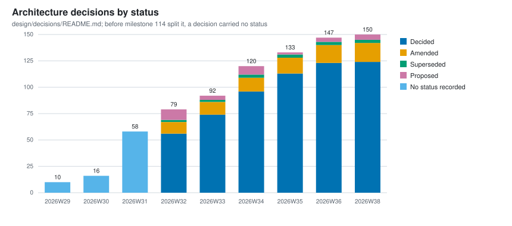
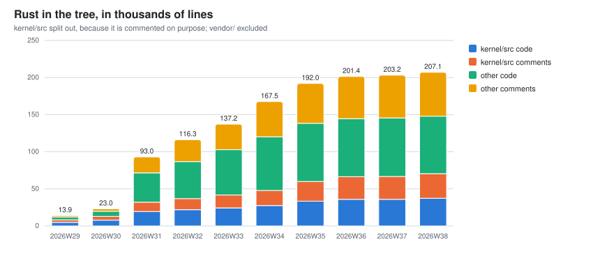
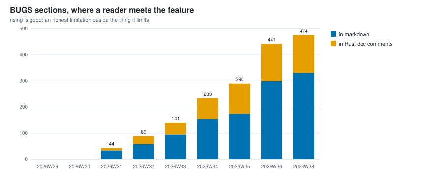
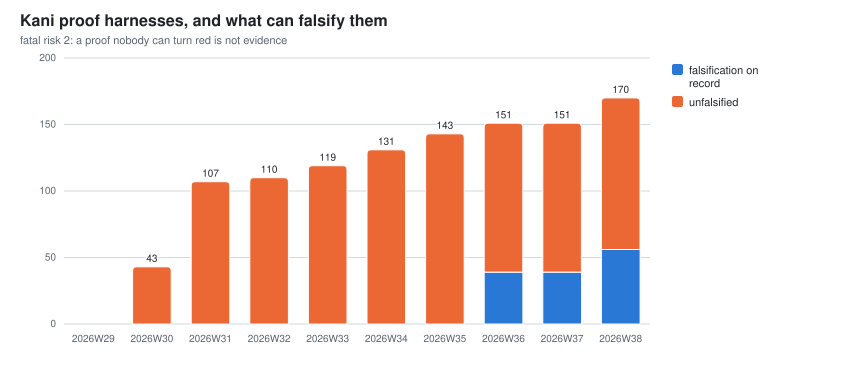
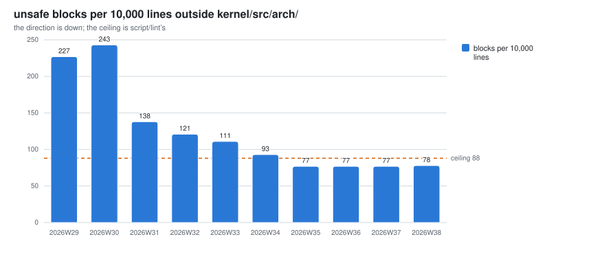
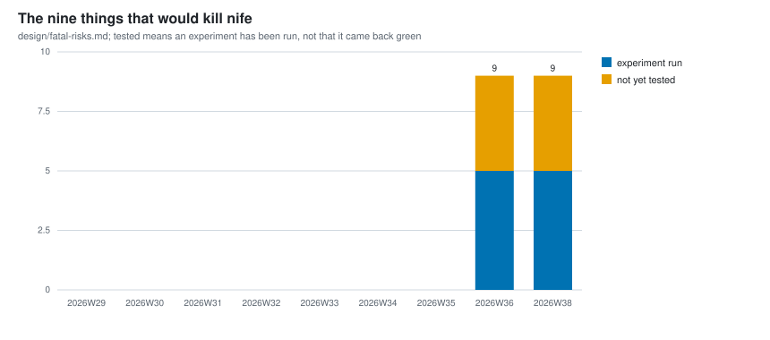
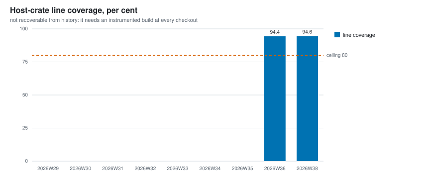

# Project metrics: what moved, week by week

*Name: `notes/project-metrics.md` is ratified (calef, 2026-09-02). He proposed it as
`design/project-metrics.md` and moved it here on the argument that `design/` holds arguments
(`fatal-risks.md`, the decisions, the roadmap) while `notes/` holds what was measured
(`benchmarks.md`, `mutation-testing.md`, `unsafe-obligations.md`). Three of the series below already
have a home in this directory. `script/metrics` and the directory `notes/project-metrics/` are
**provisional**; naming is calef's, and a lane ships a provisional name and says so.*

One row per ISO week, computed by `script/metrics` from git history. The data is
[`notes/project-metrics/weekly.csv`](project-metrics/weekly.csv), in the tree, versioned with the
code it describes, so this page renders the repository's own numbers rather than holding a copy of
them that can rot.

This is the half of `notes/register-of-measures.md` that moves. That register says which numbers
this kernel **owes itself**: which ones a decision rests on, which ones a constant is sized against,
which ones it has defined and cannot yet take. This page says which of them **changed, and when**.
Its opening line is the complaint this page exists to answer:

> This tree measures a great deal and remembers almost none of it.

## Read this before you read a number

**Every row is a restatement, not a report.** The series is regenerated by applying *today's*
definitions to old commits. That is the right choice for a trend, because a series measured seven
different ways is not a series. It is also **not what was reported at the time**, and the gap is
not hypothetical here. On 2026-09-02 alone, three of this project's own instruments turned out to
have been wrong:

- Milestone 214 (a test that prints "skipping" and returns is counted as passed) found 80 sites
  doing exactly that. Twenty-five tests left the pass column on `x86_64` once they told the truth.
- Milestone 212 (`script/falsifications` walks `crates/` only, so the ratio it prints is not the
  tree's) found the falsification denominator excluding the kernel and `user/`.
- DECISIONS §139 (who may read the cycle counter, and by what authority) corrected a figure that
  had conflated a counter's tick resolution with the cost of reading it.

So a bar here is best read as *what the tree would say today about how it looked then*, and the
distance between that and what anybody believed at the time is real.

**And every figure in this project is derived by an agent, including these.** There has been no
external audit of any of it. This is a project measuring itself with instruments it wrote, which is
an argument *for* watching the numbers move rather than against it, but the page should not be read
as an independent account. Where a number here has been checked two different ways, this page says
so explicitly and names the method; everywhere else, it has been recorded twice by the same method,
which is consistency and not validation.

**A missing bar means the record did not exist, not that the number was zero.** The roadmap, the
decision statuses, the falsification records and `design/fatal-risks.md` each arrived on a date, and
before it there is nothing to restate.

**Weeks are ISO weeks in UTC**, which is this tree's date convention. The first commits are stamped
2026-07-12 in the architect's local time and fall on the Monday in UTC, so the series starts at
2026-W29 and there is no 2026-W28.

**A week has two spellings and that is deliberate.** A chart's x axis reads `202636`, which is
calef's call. The CSV's `week` column reads `2026-W29`, which is ISO 8601's own designation for a
week: a form a reader already knows from outside this project, which sorts lexically, and which
cannot be misread as an ordinary number. It is also the dictionary key that makes rerunning
`script/metrics` replace a row rather than add one, so leaving it alone is what keeps the
idempotence below intact. The axis label is derived from the key by one function rather than stored
next to it, so the two cannot drift apart.

## Milestones by status

From `design/roadmap/README.md`'s index table. The two zero weeks are a restatement artifact and
they are the sharpest one on this page. There **was** a roadmap in 2026-W30: `design/roadmap.md`
landed 2026-07-22 with ten rows in it. It had no status column. A milestone's state was prose inside
a cell, phrased a dozen different ways (`**Built**`, `**Built (frame scope)**`, `**Built:** region
ownership ...`), which is exactly the defect the status vocabulary was later minted to fix, and it is
unparseable now for the same reason it was unreadable then. The first bar this chart can draw is the
week the column exists.

Rows 1 to 11 were backfilled into the roadmap later by milestone 76 (split the roadmap:
`design/roadmap/README.md` as index, one file per milestone). Eleven milestones had been built before
the first bar; none of them is in it.

**The interesting line is not `BUILT`, it is `NOT-STARTED`.** Built milestones went 26, 63, 73, 97,
103, 124 across the six weeks the roadmap has existed, which is a steady rate. Not-started went 16,
35, 32, 43, 62, 78. The roadmap is growing faster than the lanes drain it, and the gap widened most
in the last two weeks. That is what a project generating its own work looks like, and it is the
number to watch if the ranking function ever needs defending: a backlog that grows faster than it is
consumed is only healthy while something is choosing the order.

`REMOVED` appears for the first time in 2026-W36, with two rows. The token itself was minted
2026-08-30, when milestone 54 (a network file service a Mac can actually mount) was deleted and the
six words then available could only lie about it.

## Architecture decisions by status

From `design/decisions/README.md`. The grey band in the first three weeks is the honest bucket: a
decision was a `## N.` heading in one 5,320-line `DECISIONS.md` and **nothing said whether it still
held**. Milestone 114 (split `DECISIONS.md`, and give a decision a status) is where a status exists
at all, so counting those early decisions as `DECIDED` would invent a claim the record never carried.
They are counted, and counted as having no status.

139 decisions in eight weeks, of which 17 are `AMENDED` and 3 `SUPERSEDED`. Twenty decisions revised
or replaced out of 139 is the number that says the vocabulary is doing work: a tree where nothing was
ever amended would mean either that every first answer was right or that nobody went back.

`PROPOSED` is the queue waiting on calef and it stays small (10, 4, 8, 2, 3). It is a queue depth
rather than a backlog, which is the shape it should have.

## Rust in the tree

Every tracked `.rs` file outside `vendor/`, with `kernel/src` split from the rest. The split is the
point rather than a courtesy: the kernel is commented far more heavily than production code would be,
deliberately, so a single tree-wide ratio hides the thing that makes the number interesting.

A line counts as code if anything survives blanking its comments and string literals, and as a
comment otherwise. A line with code and a trailing comment is code.

**Two things worth reading.**

**The kernel's comment share is not flat, it is climbing.** `kernel/src` was 39.3% comment lines at
2026-W31 and is 45.2% at 2026-W36 (27,731 comment lines against 33,579 code lines), rising every
week since. `AGENTS.md` says 40%, which was accurate when it was written and is now three weeks
stale. The rest of the tree is doing the same thing more slowly, 31.5% to 41.4%. Whether that is the
kernel getting better documented or the comment-to-code ratio drifting past what a reader wants is
not a question this instrument can answer; it can only say the number moved. Flagged rather than
corrected in `AGENTS.md`, because that is calef's file.

**Total Rust fell for the first time between 2026-W35 and 2026-W36**, from 192.0k lines to 188.4k.
That is milestone 54's deletion, which is also the `REMOVED` bar two charts up. A line count that
only ever rises is measuring typing; one that falls when code is deleted is measuring the tree.

## BUGS sections

**Rising is good here, and it is worth saying plainly because the word says the opposite.** A `BUGS`
section is the FreeBSD convention this tree copies hardest: an honest limitation written next to the
feature it limits, in the manual, rather than hidden in a tracker. `AGENTS.md` calls them "not
modesty, they are the mechanism", and the reason is a newcomer's: someone who hits a limitation the
docs named will trust the docs, and someone who hits one the docs hid will not trust anything again.

Zero in the first two weeks, 355 today (234 markdown headings and 121 in Rust doc comments). A
falling line here would be the alarming one.

## Kani proof harnesses, and what can falsify them

The harness count is the whole series; the split into "falsification on record" and "unfalsified"
has exactly one point, because the record itself is four days old. Milestone 194 (build §134: the
falsification record, its lint, and the sweep that replays it) built it, and DECISIONS §134 (a
harness carries a machine-replayable falsification record, or it is not evidence) is the reason.

**36 of 146.** This is fatal risk 2's number, and the risk is that the proofs prove trivia. A proof
nobody can turn red is one level of indirection away from evidence, which is the same shape as a
roadmap status that was wrong in both records. A harness with no record at all is counted as
unfalsified, because that is what it is.

The harness count itself is taken after blanking comments, which matters more than it sounds: a raw
grep for `#[kani::proof]` finds 151, because `kernel/src/syscall.rs` explains in prose what one is
and `vendor/` and a lint shim carry four more.

## unsafe blocks outside kernel/src/arch/

Blocks per 10,000 code lines, outside `kernel/src/arch/`, which is `script/lint`'s census and the
one number in this tree that is actually gated on a direction. The dashed line is the ceiling.

227, 243, 138, 121, 111, 93, 77, 77. **The absolute count of unsafe blocks more than quadrupled over
the same period and the density fell by two thirds.** Both are true and only the second one is about
soundness: the first is a system being built. That is why the gate holds a ratio.

The one rise is 2026-W29 to 2026-W30, and it is the honest shape of an early kernel: the tree was
7,500 lines and one driver moved the number.

### How much this particular series has actually been checked

This is the one place on the page where a number has been checked two different ways, so it is worth
separating what that bought.

**A consistency check, which is what comparing against `notes/unsafe-obligations.md` is.** That note
carries a seven-point table, 227.8 down to 78.8, taken on seven different dates. It is *not* an
independent record: it is the output of this same derivation, written down seven times by lanes.
Reproducing it proves the walk agrees with what was recorded, and nothing more. It did agree. On
2026-08-18 the reconstruction hits **747 blocks over 80,359 lines exactly**, at commit `93607fa4`,
which is both figures to the digit. `unsafe impl Send`/`Sync` and the inside-`arch/` count match the
recorded value at five of the seven dates, and are within three at the other two. The residual is
which commit inside the day the column was taken at, not a difference in definition. The 2026-08-23
column is the worked example: the table prints 777 and this reconstruction prints 799, and the note's
own prose already says the count immediately before that lane's reduction "was 799, not 777", over
85,476 lines, which is this reconstruction to the digit.

**An independent check, which is a different thing.** A second counter was written from scratch for
this: a character scanner that tracks Rust's real lexical states rather than blanking comments and
literals with one regular expression. It differs deliberately in two places the regex is loose:
block comments **nest** in Rust and the regex's do not, and a lifetime `'a` is not the start of a
character literal. Run over every in-scope file at `705e3919`, the two methods agree on **701 blocks
outside `arch/` and 253 inside, with zero files disagreeing**. That is the check worth having, and it
says the shortcuts in `script/lint`'s regex do not bite in this tree.

## The nine things that would kill nife

From `design/fatal-risks.md`, which is four days old, so this is one bar and will become a series.
Four of the nine have had an experiment run; five have not.

**Tested does not mean green.** A verdict column was considered and left out on purpose: three of the
four statuses written so far say GREEN or AMBER in capitals and risk 7's says neither, so a colour
series would be a script reading a sentence and guessing. The count of risks that have been put to an
experiment at all is the fact that file actually carries. The verdicts are in the file, in prose,
where a person can read them.

## Coverage

**Empty, and it will stay empty for every week before this page existed.** Coverage is the one metric
here that cannot be recovered by walking history: it is computed per pull request in CI, stored
nowhere, and reconstructing it means a full instrumented build at every checkout in the history.
`script/metrics` is not allowed to build anything, which is what makes eight weeks of backfill cost
six seconds rather than a machine.

So the series starts when the weekly workflow first runs, and the empty bars are left visible rather
than the chart being dropped. A metric quietly omitted is worse than one visibly missing, which is
the same argument `script/falsifications` makes for its `unfalsified` state one directory over.

The floor `script/coverage` gates on is per file, not this aggregate; the dashed line is that floor
drawn for scale.

## How it stays current

`script/metrics --update` recomputes the current week's row and redraws the charts.
`.github/workflows/metrics.yml` runs it every Monday and opens a pull request if anything changed,
following `toolchain-bump.yml`, which is the closest existing shape.

**It is idempotent, and that is a property of how the file is written rather than a check on top of
it.** The CSV is never appended to. It is read into a dictionary keyed by ISO week, the week being
written **replaces its own entry**, and the whole file is rewritten from that dictionary in sorted
week order with a fixed column order. So running it twice in one week produces the same bytes, and so
does a backfill against a history that has not moved. `script/metrics --check` is exactly "run it
into memory and compare", which is why it can be trusted to say whether the tree is current.

The representative commit for a week is the first-parent commit with the greatest committer date
inside it. First-parent because that is the trunk a reader means by "the tree on that date", and
committer date because a merge's author date can be days old and would file the merge under the week
its branch was cut. For a past week that answer never changes, which is the other half of the
idempotence; for the current week it is `HEAD`, and the row moves as work lands.

## BUGS

- **`script/metrics --check` is deliberately not in `script/lint`.** Any commit changes `HEAD`, and
  the current week's row records the commit it was taken at, so a gate on it would fail every pull
  request that touched anything. The workflow is the mechanism; this is rung two of `AGENTS.md`'s
  ladder declining to be rung one, said out loud rather than left as an omission.
- **The definitions are copied, not shared.** The `unsafe` census, the code and comment line split
  and the harness count reproduce derivations that live inside `script/lint`'s and
  `script/falsifications`' `#!/bin/sh` heredocs, where nothing can import them. If either changes its
  definition, this page keeps the old one silently and diverges from the gate with nothing firing.
  Lifting them into one place is real work and is proposed rather than done.
- **A line inside a multi-line string literal counts as a comment line.** Wrong in principle,
  negligible in this tree.
- **The charts follow the reader's operating system colour preference, not GitHub's theme toggle.**
  GitHub serves an SVG in a markdown page as an ``, so a media query inside it cannot see the
  host page. A reader whose GitHub theme disagrees with their OS gets the wrong background.
- **`patches/` is outside the `unsafe` census**, inherited from `script/lint` along with its reason.
  That code does run on the machine, so it is a real hole rather than a boundary, and
  `notes/register-of-measures.md` records the blocks it leaves uncounted.
- **Nothing here is audited by anyone outside this project.** Stated once at the top and again here,
  because a dashboard is exactly the artifact that makes a reader stop asking.
